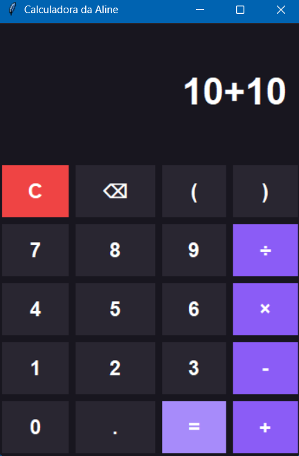

# 🧮 Calculadora Python

Meu primeiro projeto desenvolvido em Python.

Criei uma calculadora com interface gráfica, utilizando Tkinter, para praticar conceitos básicos de programação e começar a desenvolver meus primeiros projetos em Python.

## 🛠️ Tecnologias

- Python 3
- Tkinter
- Git
- VS Code

## ✨ Funcionalidades

- Adição, subtração, multiplicação e divisão
- Números decimais
- Parênteses
- Botão de limpar e apagar
- Suporte ao teclado
- Tratamento de erros

## ▶️ Como executar

Antes de começar, verifique se o Python e o Git estão instalados:

```bash
python --version
git --version
```

Depois, clone o projeto:

```bash
git clone URL_DO_REPOSITORIO
cd calculadora-python
```

Execute a calculadora:

```bash
python main.py
```

## 📚 O que pratiquei

- Variáveis e funções
- Listas e estruturas de repetição
- Condicionais
- Eventos de teclado e mouse
- Interfaces gráficas com Tkinter
- Tratamento de erros
- Git e GitHub

## 📷 Demonstração

